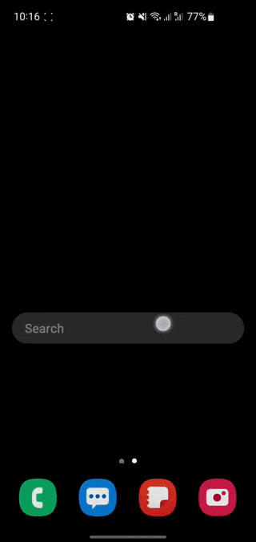

# Finder Widget
Android homescreen widget to open Samsung Finder. It works only for phones with Finder installed (Finder is installed by default on all modern Samsung phones). It won't work for other phones.

## Installation
1. Download the [latest](https://github.com/ris58h/galaxyfinder-widget/releases/download/v1.0/galaxyfinder-widget.apk) `galaxyfinder-widget.apk` from [Releases](https://github.com/ris58h/galaxyfinder-widget/releases) page.
2. Install the APK. Android will warn you about unknown source because the APK is self-signed.

## Uninstallation
There are two options:
1. Long press on the homescreen widget then click info (i) then click `Uninstall`.
2. Select `Finder Widget` in `Settings > Apps` then click `Uninstall`.
